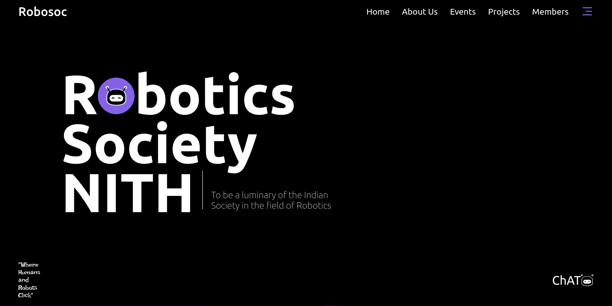
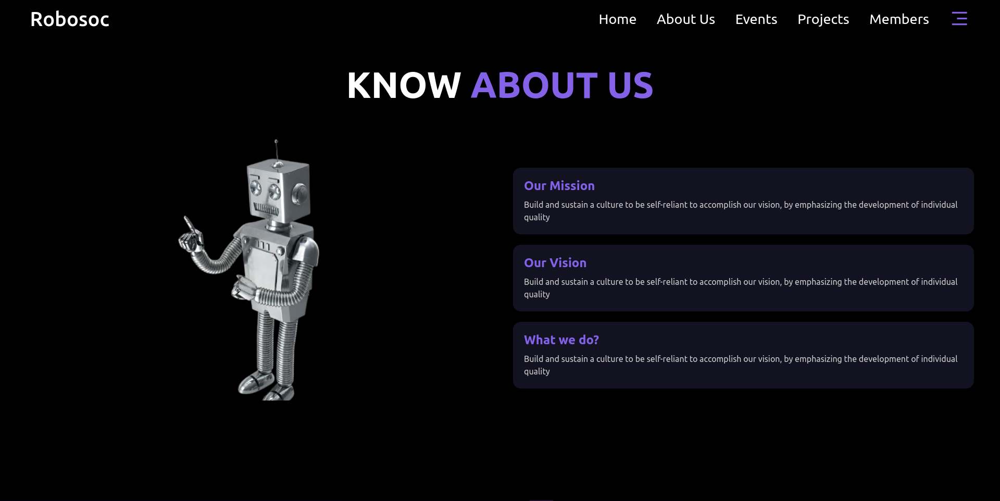

Here’s a professional `README.md` template for your website:

---

# Robotics Society NITH Website

## 📖 Overview
The official website for the **Robotics Society NITH**, show casing our vision, mission, projects, events, and members. This website serves as a central hub for our society, providing updates, resources, and interactive features.

## ✨ Features
- **Hero Section**: Eye-catching landing page with animations.
- **About Us**: Detailed information about the society's mission, vision, and objectives.
- **Projects**: Showcasing innovative robotics projects undertaken by the society.
- **Events**: Information about past and upcoming events.
- **Contact Page**: A user-friendly form for inquiries and social media links.

## 🛠️ Tech Stack
### Frontend
- **React.js**: For building the user interface.
- **Tailwind CSS**: For modern and responsive styling.
- **GSAP**: For animations and transitions.
- **Three.js**: For 3D interactive elements.

### Backend (Future Plans)
- **JSON Files**: Used for current data storage.
- **Node.js/Express.js** (Future): For API integration.
- **Database Migration**: Planning to switch to MongoDB or PostgreSQL.

## 🚀 Features in Development
- **Admin Dashboard**: For managing events, members, and projects.
- **Real-Time Features**: Chatbot integration, notifications, and more.
- **Enhanced Media Handling**: Serve images/videos more efficiently.
- **Scalable Architecture**: Support for multiple user roles and real-time collaboration.

## 🎨 Pages
1. **Home**: Introduction to the Robotics Society.
2. **About Us**: Information about our vision and mission.
3. **Projects**: Highlights of our innovative robotics projects.
4. **Events**: Updates about workshops, competitions, and other events.
5. **Contact**: A form to reach out to us and find social links.

## 📂 Folder Structure
```
.
├── src
│   ├── components
│   │   ├── Hero.jsx
│   │   ├── About.jsx
│   │   ├── Contact.jsx
│   │   ├── Events.jsx
│   │   └── Projects.jsx
│   ├── assets
│   │   ├── images
│   │   │   ├── chatBot.png
│   │   │   └── robot.png
│   │   └── styles
│   │       └── Contact.css
│   └── App.js
├── public
│   └── index.html
├── package.json
└── README.md
```

## ⚙️ Setup and Installation
1. **Clone the Repository**:
   ```bash
   git clone https://github.com/AshishNith/RoboticsReactApp.git
   cd RoboticsReactApp
   ```

2. **Install Dependencies**:
   ```bash
   npm install
   ```

3. **Start the Development Server**:
   ```bash
   npm start
   ```

4. **View in Browser**:
   Open [http://localhost:5173](http://localhost:5173) in your browser.

## 🖼️ Screenshots
### Hero Section


### About Us



## 🤝 Contribution Guidelines
We welcome contributions! To get started:
1. Fork the repository.
2. Create a feature branch:
   ```bash
   git checkout -b feature-name
   ```
3. Commit your changes:
   ```bash
   git commit -m "Add new feature"
   ```
4. Push your branch:
   ```bash
   git push origin feature-name
   ```
5. Open a Pull Request.

## 📧 Contact
For any inquiries, please contact us at:
- **Email**: ranjan.ashish9992@gmail.com
- **Phone**: +91-9934225353

## 📜 License
This project is licensed under the Robotics Society NITH. See the [LICENSE](https://github.com/AshishNith/RoboticsReactApp/blob/main/LICENSE) file for details.

---

